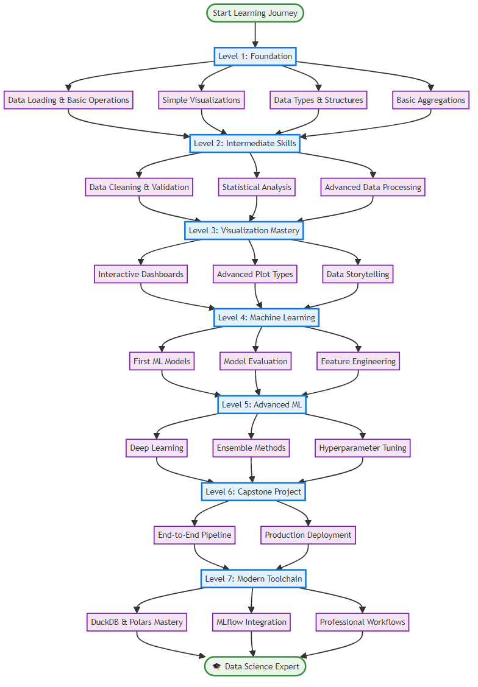

# 🎮 Data Science Sandbox

> An interactive, gamified data science learning platform with modern toolchain, professional development workflow, and comprehensive documentation.

[](https://python.org)
[](https://github.com/psf/black)
[](https://bandit.readthedocs.io)
[](https://docker.com)
[](LICENSE)

## 🌟 What is Data Science Sandbox?

Data Science Sandbox is a comprehensive learning platform that transforms data science education into an engaging, game-like experience. Built with modern tools and professional development practices, it provides a production-ready environment for learning data science from beginner to expert level.

### ✨ Key Features

#### 🎯 **Gamified Learning System**

- Progressive level system (1-7) with structured challenges
- Achievement badges and XP tracking
- **Professional iOS HIG-compliant dashboard** for progress visualization
- Self-paced learning with immediate feedback
- **Modern interface** following Apple's Human Interface Guidelines

#### 🔧 **Modern Data Science Stack**

- **DuckDB 0.9+**: High-performance analytical database
- **Polars 0.20+**: Lightning-fast DataFrame operations
- **MLflow 2.8+**: Comprehensive ML experiment tracking
- **Pandera 0.17+**: Data validation and schema enforcement

#### �️ **Professional Development Environment**

- **Code Quality**: Black formatting, Ruff linting, type checking
- **Security**: Automated vulnerability scanning with Bandit/Safety
- **Testing**: Comprehensive pytest suite with coverage reporting
- **CI/CD**: GitHub Actions workflows for automated quality assurance

#### 🐳 **Development Infrastructure**

- Docker containerized development environment
- Pre-commit hooks for consistent code quality
- VS Code integration with 16+ recommended extensions
- Automated dependency management with Dependabot

#### 📚 **Comprehensive Documentation**

- Detailed API documentation with code examples
- Architecture overview with system diagrams
- Step-by-step setup guides with troubleshooting
- Contribution guidelines for community involvement

### 📱 **Professional iOS HIG Interface**

The Data Science Sandbox features a completely redesigned interface following Apple's iOS Human Interface Guidelines for a professional, polished experience:

- **Modern Typography**: SF Pro Display font system with proper hierarchy
- **Professional Color Palette**: Complete iOS semantic color system with dark mode
- **Systematic Spacing**: 16px grid system for perfect visual alignment
- **Component Library**: iOS-style cards, buttons, and navigation elements
- **Responsive Design**: Seamless experience across desktop and mobile devices

**Access the modern interface:**

```bash
# Launch the professional iOS HIG-compliant dashboard
python -m streamlit run streamlit_app_modern.py --server.port=8502
```

## 🚀 Quick Start

### Option 1: Standard Installation

1. **Clone the repository**

   ```bash
   git clone https://github.com/and3rn3t/data.git
   cd data
   ```

2. **Set up Python environment**

   ```bash
   python -m venv venv
   source venv/bin/activate  # Linux/macOS
   venv\Scripts\activate     # Windows
   ```

3. **Install dependencies**

   ```bash
   pip install -r requirements.txt
   pip install -r requirements-dev.txt  # For development
   ```

### Option 2: Docker Development

1. **Using Docker Compose**

   ```bash
   git clone https://github.com/and3rn3t/data.git
   cd data
   docker-compose up -d
   ```

2. **Access services**
   - Main application: <http://localhost:8000>
   - Jupyter Lab: <http://localhost:8888>
   - MLflow UI: <http://localhost:5000>

### 🎮 Launch Options

```bash
# Interactive Dashboard
python main.py --mode dashboard

   # Command Line Interface
   python main.py --mode cli

   # Jupyter Lab Environment
   python main.py --mode jupyter
```

### First Steps

1. Start with **Level 1: Data Explorer** to learn the basics
2. Complete challenges to earn XP and unlock new levels
3. Use the dashboard to track your progress and achievements
4. Practice with real datasets in the Jupyter environment

## � Project Structure

The project follows a clean, organized structure for easy navigation:

```text
data-science-sandbox/
├── 🚀 apps/                    # User-facing applications
│   ├── streamlit_app.py        # Original dashboard
│   └── streamlit_app_modern.py # Modern iOS HIG dashboard
├── 💡 examples/                # Demo scripts and examples
├── 🏃 runners/                 # Challenge runners and validation
├── 📚 docs/                    # Comprehensive documentation
│   ├── level-summaries/        # Learning progress docs
│   ├── implementation/         # Technical guides
│   └── project-management/     # Planning and tracking
├── 🧪 tests/                   # Test suite
├── 🔧 sandbox/                 # Core source code
├── 📊 data/                    # Datasets and data generation
├── 📓 notebooks/               # Jupyter notebooks
├── 🎯 challenges/              # Learning challenges (Levels 1-7)
└── ⚙️ scripts/                 # Build and deployment scripts
```

**Key Entry Points:**

- `main.py` - Primary application launcher
- `apps/streamlit_app_modern.py` - Modern dashboard interface
- `examples/` - Demo scripts showcasing features
- `docs/README.md` - Complete documentation index

## �📚 Learning Path



> **Progressive Learning System**: Our structured curriculum takes you from beginner to expert through 7 comprehensive levels with hands-on challenges.

### 🥇 Level 1: Data Explorer

_Learn basic data manipulation and visualization_

- Loading and exploring datasets
- Basic pandas operations
- Creating simple visualizations
- Understanding data types and structures

### 🥈 Level 2: Analytics Apprentice

_Master statistical analysis and data cleaning_

- Data cleaning and preprocessing
- Handling missing values and outliers
- Statistical analysis and hypothesis testing
- Advanced data manipulation

### 🥉 Level 3: Visualization Virtuoso

_Create stunning data visualizations_

- Advanced plotting with matplotlib and seaborn
- Interactive visualizations with plotly
- Dashboard creation
- Data storytelling techniques

### 🏆 Level 4: Machine Learning Novice

_Build your first ML models_

- Supervised learning algorithms
- Model evaluation and validation
- Feature engineering and selection
- Classification and regression projects

### 🎖️ Level 5: Algorithm Architect

_Advanced ML algorithms and optimization_

- Ensemble methods and advanced algorithms
- Hyperparameter tuning and optimization
- Cross-validation and model selection
- Deep learning fundamentals

### 🏅 Level 6: Data Science Master

_Complex projects and real-world challenges_

- End-to-end data science projects
- Time series analysis and forecasting
- Natural language processing
- Computer vision applications

### 🚀 Level 7: Modern Tools Master

_Cutting-edge data science toolchain_

- High-performance data processing (Polars, DuckDB)
- ML experiment tracking (MLflow, Weights & Biases)
- Model explainability (SHAP, LIME, Yellowbrick)
- Automated hyperparameter optimization (Optuna)

## 🎯 Challenge Categories

- 📊 **Data Exploration & Understanding**
- 🧹 **Data Cleaning & Preprocessing**
- 📈 **Data Visualization**
- 📉 **Statistical Analysis**
- 🤖 **Machine Learning**
- 🧠 **Deep Learning**
- ⏰ **Time Series Analysis**
- 💬 **Natural Language Processing**
- 👁️ **Computer Vision**
- 🌍 **Real-World Projects**

## 🏆 Achievement System

Earn badges by completing specific objectives:

- 🎯 **First Steps**: Complete your first challenge
- 🧹 **Data Cleaner**: Clean a messy dataset
- 📊 **Viz Master**: Create 5 different chart types
- 📈 **Stats Guru**: Complete statistical analysis challenges
- 🤖 **ML Rookie**: Build your first machine learning model
- ⚡ **Model Optimizer**: Improve model performance by 10%
- 📖 **Data Storyteller**: Create a complete data story
- 🏅 **Problem Solver**: Complete all challenges in a level

## 📁 Project Structure

```text
data-science-sandbox/
├── main.py                 # Main application entry point
├── config.py               # Configuration and game settings
├── requirements.txt        # Python dependencies
├── setup.py               # Package setup
│
├── sandbox/               # Core application modules
│   ├── core/             # Game engine and dashboard
│   ├── levels/           # Level-specific content
│   ├── achievements/     # Badge and achievement logic
│   └── utils/            # Utility functions
│
├── challenges/           # Coding challenges by level
│   ├── level_1/         # Beginner challenges
│   ├── level_2/         # Intermediate challenges
│   └── ...              # Advanced challenges
│
├── notebooks/           # Interactive learning materials
│   ├── beginner/        # Level 1-2 notebooks
│   ├── intermediate/    # Level 3-4 notebooks
│   └── advanced/        # Level 5-6 notebooks
│
├── data/                # Datasets and resources
│   ├── datasets/        # Sample datasets for practice
│   └── samples/         # Example outputs and solutions
│
├── docs/                # Documentation
└── tests/               # Unit tests
```

## 🎮 Interface Modes

### 1. Interactive Dashboard (Recommended)

- Web-based interface with progress tracking
- Visual charts and statistics
- Easy navigation between levels and challenges
- Launch: `python main.py --mode dashboard`

### 2. Command Line Interface

- Terminal-based interaction
- Perfect for command-line enthusiasts
- Full feature access via text interface
- Launch: `python main.py --mode cli`

### 3. Jupyter Lab Environment

- Ideal for hands-on coding practice
- Interactive notebooks with guided exercises
- Immediate code execution and visualization
- Launch: `python main.py --mode jupyter`

## � Modern Development Stack

Data Science Sandbox leverages cutting-edge tools for a professional development experience:

### **Core Technologies**

- **🐍 Python 3.8+** - Modern Python with type hints
- **⚡ DuckDB** - High-performance analytical database
- **🏎️ Polars** - Lightning-fast DataFrame operations
- **🧪 MLflow** - Machine learning experiment tracking
- **📊 Streamlit** - Interactive web dashboards

### **Quality Assurance**

- **🖤 Black** - Code formatting
- **🦀 Ruff** - Modern Python linting
- **🔒 Bandit** - Security vulnerability scanning
- **🧪 pytest** - Comprehensive testing framework
- **📝 Pandera** - Data validation schemas

### **Development Environment**

- **🐳 Docker** - Containerized development
- **🔧 Pre-commit** - Automated code quality checks
- **🚀 GitHub Actions** - CI/CD pipeline
- **📝 VS Code** - Enhanced development experience

### **Quick Development Setup**

```bash
# Clone and setup
git clone https://github.com/and3rn3t/data.git
cd data

# Install dependencies (dev tools included)
pip install -r requirements.txt
pip install -r requirements-dev.txt

# Initialize modern tools
python -c "from sandbox.utils.modern_tools_config import initialize_all_tools; initialize_all_tools()"
```

## �📊 Sample Datasets

The platform includes several curated datasets for learning:

- **📈 Sales Data** (1000 records): Regional sales with customer demographics
- **🌸 Iris Dataset**: Classic ML dataset for classification
- **📚 Simple Data**: Perfect for absolute beginners
- **🏠 Housing Prices**: Regression practice dataset
- **🛒 E-commerce**: Customer behavior analysis
- **📱 Tech Stock Prices**: Time series analysis

## 🛠️ Technology Stack

### Core Data Science Libraries

- **Python 3.8+**: Core language
- **Pandas & NumPy**: Data manipulation and analysis
- **Matplotlib & Seaborn**: Static visualizations
- **Plotly**: Interactive visualizations
- **Scikit-learn**: Machine learning algorithms

### Modern High-Performance Tools

- **Polars**: Lightning-fast DataFrame operations (2-30x faster than pandas)
- **DuckDB**: High-performance analytical database with SQL interface
- **PyArrow**: Columnar in-memory analytics

### ML Operations & Tracking

- **MLflow**: Experiment tracking and model management
- **Weights & Biases**: Advanced experiment tracking with rich visualizations
- **Optuna**: State-of-the-art hyperparameter optimization

### Model Understanding & Explainability

- **SHAP**: Unified model explanations with game-theoretic foundation
- **LIME**: Local interpretable model explanations
- **Yellowbrick**: Machine learning visualization library

### Development & Deployment

- **Streamlit**: Web dashboard interface
- **Jupyter Lab**: Interactive development environment
- **FastAPI**: Modern API development for ML models
- **Flask**: Additional web components

### Advanced ML Libraries

- **XGBoost & LightGBM**: Gradient boosting frameworks
- **TensorFlow & PyTorch**: Deep learning frameworks
- **Transformers**: Pre-trained NLP models (Hugging Face)
- **Statsmodels**: Statistical analysis and time series

## 🤝 Contributing

We welcome contributions! Here's how you can help:

1. **Add new challenges**: Create exercises for any level
2. **Improve documentation**: Help others get started
3. **Create datasets**: Add interesting practice datasets
4. **Fix bugs**: Report and fix issues you find
5. **Suggest features**: Ideas for new functionality

## 📖 Documentation

- [Getting Started Guide](docs/getting-started.md)
- [Challenge Creation Guide](docs/creating-challenges.md)
- [API Documentation](docs/api-reference.md)
- [FAQ](docs/faq.md)

## 📄 License

This project is licensed under the MIT License - see the [LICENSE](LICENSE) file for details.

## 🎉 Getting Help

- 📧 **Issues**: Report bugs or request features via GitHub Issues
- 💬 **Discussions**: Join the community discussion
- 📚 **Wiki**: Check the wiki for detailed guides
- 🔗 **Discord**: Join our learning community (coming soon!)

---

**Start your data science journey today! 🚀**

_Made with ❤️ for the data science community_
