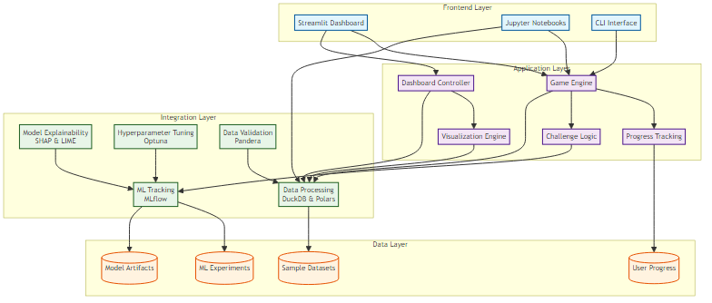
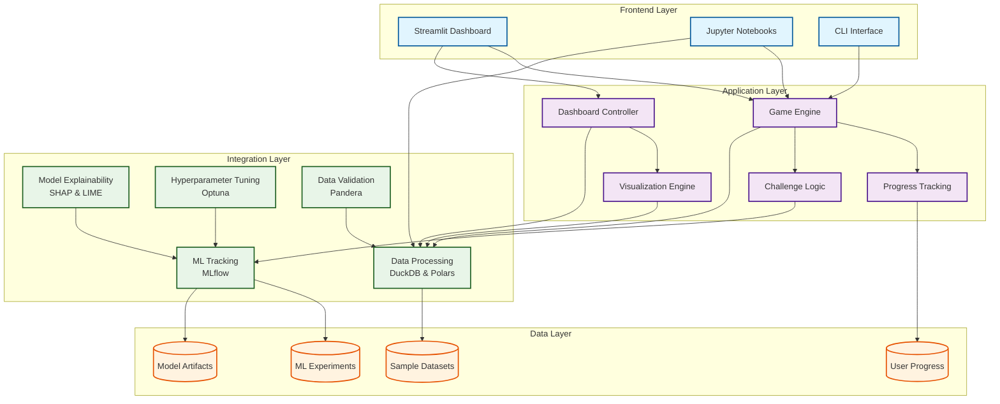
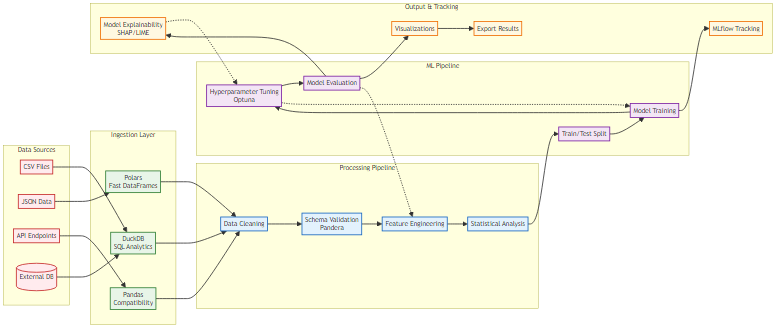

# Architecture Overview

This document describes the technical architecture of the Data Science Sandbox platform.

## System Architecture



> **Interactive Diagram**: The above diagram shows the complete system architecture with color-coded layers and component relationships.



## Core Components

### 1. Game Engine (`sandbox/core/game_engine.py`)

The central orchestrator that manages:

- **Progress Tracking**: Player level, XP, completed challenges
- **Challenge Management**: Available challenges per level
- **Badge System**: Achievement tracking and rewards
- **Save/Load**: Persistent progress storage

**Key Design Decisions:**

- JSON-based storage for simplicity and portability
- Event-driven architecture for extensibility
- Immutable progress objects for thread safety

```python
# Core game loop
class GameEngine:
    def __init__(self):
        self.progress = self._load_progress()
        self.challenges = self._load_challenges()
        self.badges = self._load_badges()

    def complete_challenge(self, challenge_id: str) -> bool:
        # Validate challenge
        # Update progress
        # Award XP and badges
        # Save progress
```

### 2. Dashboard (`sandbox/core/dashboard.py`)

Interactive web interface built with Streamlit:

- **iOS-Inspired Design**: Modern, clean interface
- **Real-time Updates**: Live progress visualization
- **Interactive Charts**: Plotly-based analytics
- **Responsive Layout**: Multi-device support

**Architecture Patterns:**

- Component-based UI architecture
- State management through session state
- Lazy loading for performance
- Caching for data-heavy operations

### 3. Integration Layer (`sandbox/integrations/`)

Modular integrations for modern data science tools:

#### Modern Data Processing

- **DuckDB Integration**: SQL analytics on DataFrames
- **Polars Support**: High-performance data operations
- **Lazy Evaluation**: Memory-efficient processing

#### ML Operations

- **MLflow Tracking**: Experiment management
- **Model Registry**: Version control for models
- **Artifact Storage**: Model and data versioning

#### Model Explainability

- **SHAP Integration**: Game-theoretic explanations
- **LIME Support**: Local interpretable explanations
- **Yellowbrick Visualization**: ML diagnostic plots

#### Hyperparameter Optimization

- **Optuna Backend**: Bayesian optimization
- **Hyperopt Support**: Tree-structured Parzen estimators
- **Scikit-Optimize**: Gaussian process optimization

### 4. Utility Layer (`sandbox/utils/`)

Supporting infrastructure:

#### Data Validation

- **Pandera Schemas**: Type-safe data validation
- **Quality Checks**: Completeness, consistency, correctness
- **Business Rules**: Domain-specific validation

#### Logging System

- **Structured Logging**: JSON-formatted logs
- **Multiple Handlers**: Console, file, error separation
- **Performance Tracking**: Decorator-based timing

#### Configuration Management

- **Tool Initialization**: Centralized setup
- **Environment Detection**: Automatic configuration
- **Graceful Fallbacks**: Resilient to missing dependencies

## Data Flow

### 1. User Interaction Flow

```text
User Input → Frontend (CLI/Dashboard/Jupyter)
          → Game Engine
          → Challenge Validation
          → Progress Update
          → Data Processing
          → Results Display
```

### 2. ML Experiment Flow

```text
Data Loading → Validation (Pandera)
            → Processing (DuckDB/Polars)
            → Model Training
            → Experiment Tracking (MLflow)
            → Model Evaluation
            → Explainability Analysis
            → Results Storage
```

### 3. Data Processing Pipeline



> **High-Performance Pipeline**: The data processing architecture leverages DuckDB for analytical queries and Polars for fast DataFrame operations, with comprehensive validation and ML tracking.

```mermaid
graph LR
    %% Data Processing Pipeline

    subgraph "Data Sources"
        CSV[CSV Files]
        JSON[JSON Data]
        API[API Endpoints]
        DB[(External DB)]
    end

    subgraph "Ingestion Layer"
        DUCK[DuckDB<br/>SQL Analytics]
        POLARS[Polars<br/>Fast DataFrames]
        PANDAS[Pandas<br/>Compatibility]
    end

    subgraph "Processing Pipeline"
        CLEAN[Data Cleaning]
        VALIDATE[Schema Validation<br/>Pandera]
        TRANSFORM[Feature Engineering]
        ANALYZE[Statistical Analysis]
    end

    subgraph "ML Pipeline"
        SPLIT[Train/Test Split]
        TRAIN[Model Training]
        TUNE[Hyperparameter Tuning<br/>Optuna]
        EVALUATE[Model Evaluation]
    end

    subgraph "Output & Tracking"
        VIZ[Visualizations]
        TRACK[MLflow Tracking]
        EXPLAIN[Model Explainability<br/>SHAP/LIME]
        EXPORT[Export Results]
    end

    %% Data Flow
    CSV --> DUCK
    JSON --> POLARS
    API --> PANDAS
    DB --> DUCK

    DUCK --> CLEAN
    POLARS --> CLEAN
    PANDAS --> CLEAN

    CLEAN --> VALIDATE
    VALIDATE --> TRANSFORM
    TRANSFORM --> ANALYZE

    ANALYZE --> SPLIT
    SPLIT --> TRAIN
    TRAIN --> TUNE
    TUNE --> EVALUATE

    EVALUATE --> VIZ
    TRAIN --> TRACK
    EVALUATE --> EXPLAIN
    VIZ --> EXPORT

    %% Feedback Loops
    TUNE -.-> TRAIN
    EVALUATE -.-> TRANSFORM
    EXPLAIN -.-> TUNE

    %% Styling
    classDef source fill:#ffebee,stroke:#c62828,stroke-width:2px
    classDef ingestion fill:#e8f5e8,stroke:#2e7d32,stroke-width:2px
    classDef processing fill:#e3f2fd,stroke:#1565c0,stroke-width:2px
    classDef ml fill:#f3e5f5,stroke:#7b1fa2,stroke-width:2px
    classDef output fill:#fff8e1,stroke:#ef6c00,stroke-width:2px

    class CSV,JSON,API,DB source
    class DUCK,POLARS,PANDAS ingestion
    class CLEAN,VALIDATE,TRANSFORM,ANALYZE processing
    class SPLIT,TRAIN,TUNE,EVALUATE ml
    class VIZ,TRACK,EXPLAIN,EXPORT output
```



## Technology Choices

### Backend Technologies

| Component           | Technology      | Rationale                               |
| ------------------- | --------------- | --------------------------------------- |
| **Core Language**   | Python 3.8+     | Data science ecosystem, type hints      |
| **Web Framework**   | Streamlit       | Rapid prototyping, data science focused |
| **Data Processing** | DuckDB + Polars | Performance, SQL compatibility          |
| **ML Tracking**     | MLflow          | Industry standard, comprehensive        |
| **Data Validation** | Pandera         | Type safety, schema validation          |

### Development Tools

| Tool           | Purpose         | Benefits                        |
| -------------- | --------------- | ------------------------------- |
| **Black**      | Code formatting | Consistency, zero configuration |
| **Ruff**       | Linting         | Speed, comprehensive checks     |
| **pytest**     | Testing         | Powerful, extensible            |
| **mypy**       | Type checking   | Runtime error prevention        |
| **pre-commit** | Quality gates   | Automated enforcement           |

### Performance Considerations

#### DuckDB for Analytics

- **In-memory processing**: 10-100x faster than pandas for analytics
- **SQL interface**: Familiar query language
- **Columnar storage**: Optimized for analytical workloads

#### Polars for Data Manipulation

- **Rust backend**: Memory efficiency and speed
- **Lazy evaluation**: Optimized query planning
- **Arrow memory format**: Zero-copy operations

#### Streamlit Optimizations

- **Component caching**: `@st.cache_data` for expensive operations
- **Session state**: Persistent data across interactions
- **Lazy loading**: Load data only when needed

## Security Architecture

### Input Validation

```python
# All user inputs validated through Pandera schemas
@pa.check_input(schema, lazy=True)
def process_user_data(df: pd.DataFrame) -> pd.DataFrame:
    return validated_processing(df)
```

### Dependency Management

- **Automated scanning**: Bandit for code security
- **Vulnerability checking**: Safety for dependencies
- **Regular updates**: Dependabot automation

### Isolation

- **Docker containers**: Isolated execution environment
- **Virtual environments**: Dependency isolation
- **Sandboxed execution**: Safe code execution

## Scalability Design

### Horizontal Scaling

- **Stateless components**: Easy to replicate
- **External storage**: Shared data layer
- **Load balancing**: Multiple dashboard instances

### Vertical Scaling

- **Memory optimization**: Polars lazy evaluation
- **CPU utilization**: Parallel processing support
- **I/O efficiency**: DuckDB columnar storage

### Caching Strategy

```python
# Multi-level caching
@st.cache_data(ttl=3600)  # 1 hour cache
def expensive_computation(data):
    return process_large_dataset(data)

# Persistent caching
@lru_cache(maxsize=128)
def model_predictions(model_id, features):
    return load_and_predict(model_id, features)
```

## Testing Strategy

### Unit Tests

- **Core logic**: Game engine, progress tracking
- **Integrations**: Mock external dependencies
- **Utilities**: Data validation, logging

### Integration Tests

- **End-to-end workflows**: Challenge completion flow
- **External services**: MLflow, DuckDB connections
- **Data pipelines**: Full processing workflows

### Performance Tests

- **Load testing**: Dashboard responsiveness
- **Memory profiling**: Large dataset handling
- **Benchmarking**: DuckDB vs pandas performance

## Deployment Architecture

### Development Environment

```yaml
# docker-compose.dev.yml
services:
  sandbox-dev:
    build: .
    volumes:
      - .:/app
    ports:
      - "8501:8501" # Streamlit
      - "5000:5000" # MLflow

  postgres:
    image: postgres:15
    environment:
      POSTGRES_DB: sandbox_db
```

### Production Deployment

- **Container orchestration**: Docker Swarm or Kubernetes
- **Load balancing**: Nginx or cloud load balancer
- **Monitoring**: Prometheus + Grafana
- **Logging**: ELK stack or cloud logging

### CI/CD Pipeline

```yaml
# .github/workflows/ci.yml
name: CI/CD Pipeline
on: [push, pull_request]

jobs:
  test:
    runs-on: ubuntu-latest
    steps:
      - uses: actions/checkout@v3
      - name: Run tests
        run: pytest --cov=sandbox
      - name: Security scan
        run: bandit -r sandbox/
      - name: Quality check
        run: ruff check sandbox/
```

## Monitoring and Observability

### Application Metrics

- **User engagement**: Challenge completion rates
- **Performance**: Response times, memory usage
- **Errors**: Exception tracking and alerting

### Business Metrics

- **Learning progress**: XP distribution, level advancement
- **Feature usage**: Most popular challenges, tools
- **Retention**: User activity patterns

### Logging Strategy

```python
# Structured logging
logger = logging.getLogger(__name__)

def complete_challenge(challenge_id: str):
    logger.info(
        "Challenge completed",
        extra={
            "challenge_id": challenge_id,
            "user_level": self.get_current_level(),
            "xp_earned": calculate_xp(challenge_id)
        }
    )
```

## Future Architecture Considerations

### Microservices Migration

- **Service boundaries**: Game engine, ML services, data processing
- **API design**: RESTful APIs with OpenAPI documentation
- **Service mesh**: Istio for communication and security

### Cloud Native Features

- **Auto-scaling**: Based on user load
- **Serverless functions**: Challenge execution
- **Managed services**: Cloud ML platforms integration

### Advanced ML Integration

- **Model serving**: TensorFlow Serving, MLflow Model Server
- **Feature stores**: Feast, Tecton integration
- **AutoML**: Integration with cloud AutoML services
