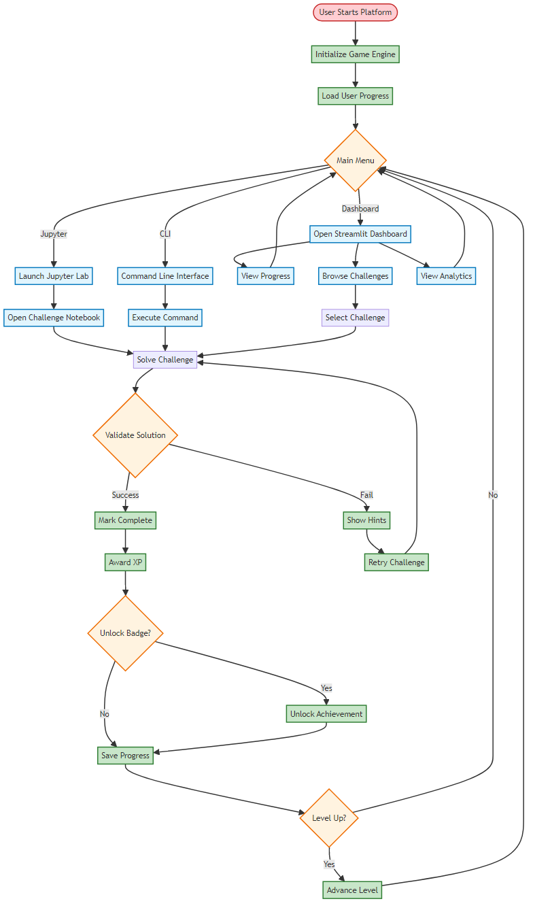
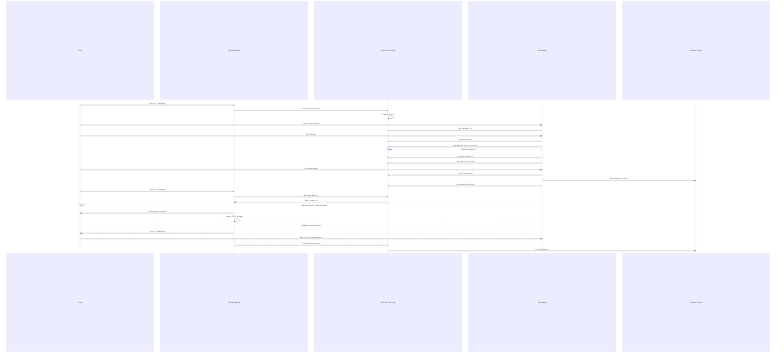
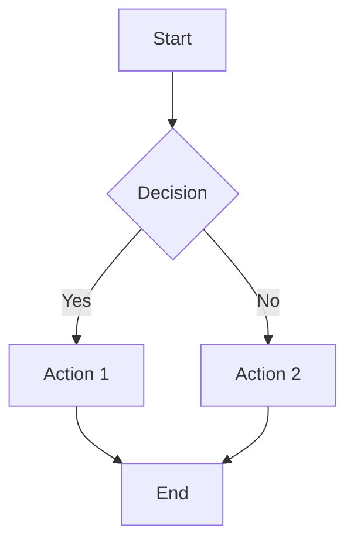
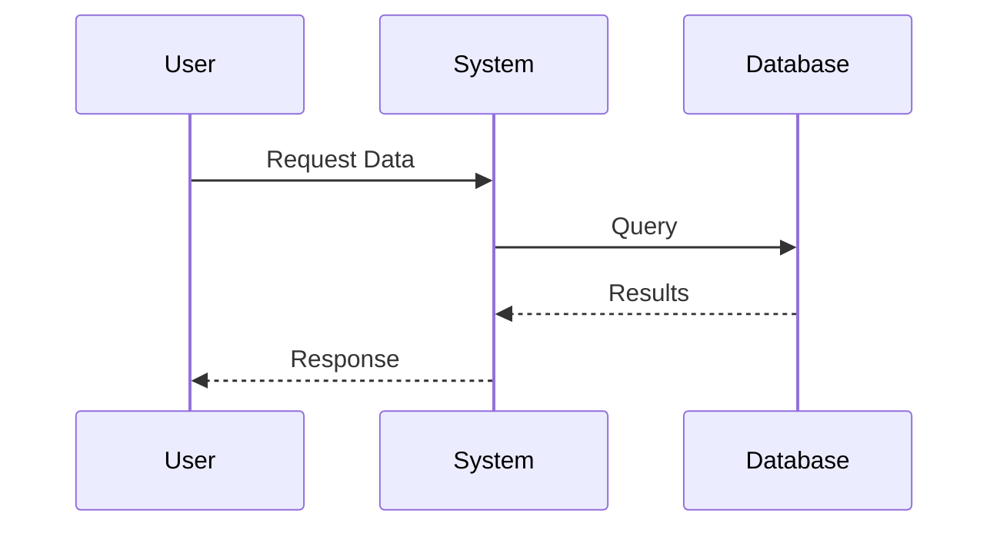
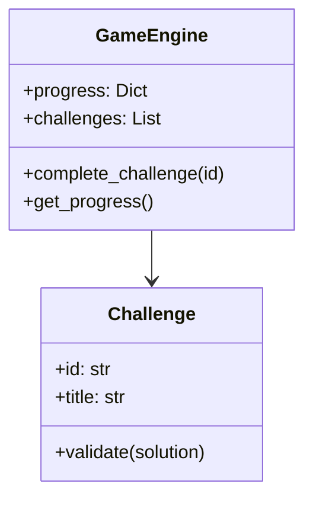
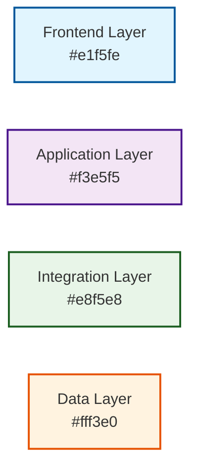

# Mermaid Diagrams Guide

This guide explains how to create, edit, and use Mermaid diagrams in the Data Science Sandbox project.

## Overview

Mermaid is a diagramming and charting tool that renders Markdown-inspired text definitions to create and modify diagrams dynamically. We use Mermaid to create beautiful, maintainable diagrams for our documentation.

## Available Diagrams

### 1. System Architecture (`architecture.mmd`)

Shows the complete system architecture with layered components:

- **Frontend Layer**: Streamlit Dashboard, Jupyter Notebooks, CLI Interface
- **Application Layer**: Game Engine, Progress Tracking, Challenge Logic
- **Integration Layer**: Modern data tools (DuckDB, Polars, MLflow)
- **Data Layer**: Datasets, Progress, Experiments, Artifacts

**Usage in Documentation:**

```markdown

```

### 2. Data Processing Pipeline (`data-pipeline.mmd`)

Illustrates the data flow from ingestion to output:

- Data sources (CSV, JSON, APIs, Databases)
- Processing layers (DuckDB, Polars, Pandas)
- ML pipeline (Training, Tuning, Evaluation)
- Output and tracking (Visualizations, MLflow, Explainability)

**Usage in Documentation:**

```markdown

```

### 3. Game Flow (`game-flow.mmd`)

Shows the user journey through the gamified learning system:

- Menu navigation and mode selection
- Challenge selection and completion
- Progress tracking and badge unlocking
- Level advancement system

**Usage in Documentation:**

```markdown

```

### 4. Learning Path (`learning-path.mmd`)

Visualizes the progressive learning curriculum:

- 7 levels from Foundation to Expert
- Challenge progression within each level
- Skill development pathway
- Milestone achievements

**Usage in Documentation:**

```markdown

```

### 5. ML Experiment Tracking (`ml-tracking.mmd`)

Sequence diagram showing MLflow integration:

- Experiment initialization and management
- Parameter and metric logging
- Model artifact storage
- Challenge validation workflow

**Usage in Documentation:**

```markdown

```

## Working with Diagrams

### Directory Structure

```
docs/
├── diagrams/           # Source .mmd files
│   ├── architecture.mmd
│   ├── data-pipeline.mmd
│   ├── game-flow.mmd
│   ├── learning-path.mmd
│   └── ml-tracking.mmd
└── images/            # Generated .png files
    ├── architecture.png
    ├── data-pipeline.png
    ├── game-flow.png
    ├── learning-path.png
    └── ml-tracking.png
```

### Building Diagrams

#### Option 1: Build All Diagrams

```bash
npm run build-all-diagrams
```

#### Option 2: Build Individual Diagram

```bash
npx @mermaid-js/mermaid-cli -i docs/diagrams/architecture.mmd -o docs/images/architecture.png -b white --scale 2
```

#### Option 3: Using Python Utility

```python
from sandbox.utils.mermaid_integration import MermaidRenderer

renderer = MermaidRenderer()
results = renderer.render_all_diagrams()
```

### Creating New Diagrams

1. **Create the `.mmd` file** in `docs/diagrams/`
2. **Write Mermaid syntax** (see examples below)
3. **Build the diagram** using npm script or Python utility
4. **Include in documentation** using markdown image syntax

### Mermaid Syntax Examples

#### Graph/Flowchart



#### Sequence Diagram



#### Class Diagram



### Styling Guidelines

We use consistent color schemes across diagrams:

#### Color Palette



#### Style Classes

- **Frontend**: Light blue (`#e1f5fe`) with dark blue border
- **Application**: Light purple (`#f3e5f5`) with dark purple border
- **Integration**: Light green (`#e8f5e8`) with dark green border
- **Data**: Light orange (`#fff3e0`) with dark orange border

### Best Practices

#### 1. Diagram Design

- **Keep it simple**: Focus on key relationships and flows
- **Use consistent styling**: Apply our color scheme
- **Label clearly**: Use descriptive node names
- **Group logically**: Use subgraphs for related components

#### 2. File Organization

- **Descriptive names**: Use kebab-case for filenames
- **Version control**: Commit both `.mmd` and `.png` files
- **Documentation**: Update docs when adding new diagrams

#### 3. Integration with Documentation

- **Image references**: Always include both PNG and Mermaid code
- **Alt text**: Provide meaningful alternative text
- **Context**: Add explanatory text around diagrams

### Troubleshooting

#### Common Issues

**1. Syntax Errors**

```bash
Error: Parse error on line X
```

- Check Mermaid syntax against [official documentation](https://mermaid-js.github.io/mermaid/)
- Validate brackets, quotes, and special characters
- Ensure proper indentation

**2. Build Failures**

```bash
Command failed: npx @mermaid-js/mermaid-cli
```

- Ensure Node.js and npm dependencies are installed
- Check file paths are correct
- Verify Mermaid CLI is properly installed

**3. Styling Not Applied**

```mermaid
%% Ensure class definitions come after node definitions
classDef myclass fill:#color,stroke:#border
class NodeName myclass
```

#### Debug Commands

**Test Mermaid CLI Installation:**

```bash
npx @mermaid-js/mermaid-cli --version
```

**Validate Diagram Syntax:**

```bash
npx @mermaid-js/mermaid-cli -i diagram.mmd -o test.png --dry-run
```

**Check Generated Images:**

```bash
ls -la docs/images/
```

### Advanced Features

#### Custom Themes

Create custom theme configurations:

```json
{
  "theme": "base",
  "themeVariables": {
    "primaryColor": "#e1f5fe",
    "primaryTextColor": "#01579b",
    "primaryBorderColor": "#0277bd",
    "lineColor": "#333"
  }
}
```

#### Interactive Diagrams

For web-based documentation, embed interactive Mermaid:

```html
<script src="https://cdn.jsdelivr.net/npm/mermaid/dist/mermaid.min.js"></script>
<script>
  mermaid.initialize({ startOnLoad: true });
</script>

<div class="mermaid">graph TD A --> B</div>
```

#### Automation with GitHub Actions

Add diagram building to CI/CD:

```yaml
- name: Build Mermaid Diagrams
  run: |
    npm install
    npm run build-all-diagrams
```

## Resources

- **Mermaid Documentation**: <https://mermaid-js.github.io/mermaid/>
- **Live Editor**: <https://mermaid.live/>
- **VS Code Extension**: Mermaid Preview
- **CLI Documentation**: <https://github.com/mermaid-js/mermaid-cli>

## Examples in This Project

All diagrams in this project are available as both source (`.mmd`) and generated images (`.png`):

1. **Architecture Overview**: System design and component relationships
2. **Data Pipeline**: High-performance data processing workflow
3. **Game Flow**: User journey through gamified learning
4. **Learning Path**: Progressive curriculum structure
5. **ML Tracking**: Experiment management and model lifecycle

Each diagram is integrated into relevant documentation sections with both PNG images (for GitHub/static viewing) and Mermaid code blocks (for interactive documentation systems).

---

_This guide is part of the Data Science Sandbox documentation system, designed to maintain clear, beautiful, and maintainable technical diagrams._
